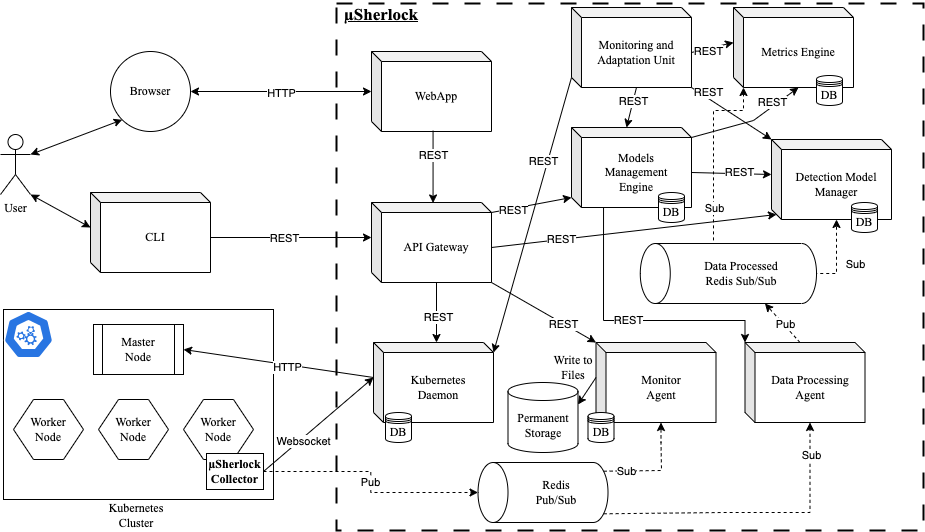

# µSherlock


## What is it?

µSherlock is designed around core components that operate to deliver the intended service. 
The intrusion detection module, that operates detection models (training and detection), the processing modules (store data, apply data processing approaches, etc.), a monitoring and adaptation module, that uses the custom metric and alarm data, to apply the resilience measures, and the interface modules, the API gateway, web application, and the interaction with the cluster through the Kubernetes daemon.
The components mainly communicate over HTTP/REST, which provides lightweight, and flexible communication while reinforcing interoperability and independence between components.
Some communication channels rely on the publish/subscribe model that provides various relevant guarantees in data transference, such as multiple receivers for a source of information.

The implementation of µSherlock was mainly conducted using the [FastAPI](https://fastapi.tiangolo.com/) framework with Python.
Each service exposes a REST API to allow for communication with other services.
The consumers, a Web Application and a command line interface, were developed using [Next.JS](https://nextjs.org/) and [Typer](https://typer.tiangolo.com/), respectively.

The tool leverages two message queues using [Redis](https://redis.io/): one to distribute the collected system calls from the cluster and other to deliver it after being processed by the data processing techniques.
To collect the system call data from the microservice application being monitored, µSherlock uses the [Kubernetes Python client](https://github.com/kubernetes-client/python) to interact with the cluster and deploy a daemonset from a custom µSherlock collector.
A Kubernetes daemonset ensures that for each operating node there is a pod deployed to collect the system call data using a [sysdig](https://sysdig.com/) probe.
The daemonset collects the data and forwards it to the Redis queue.


### Installation
Pre-requisites include a kubernetes cluster setup and a microservice application deployed (for example [TeaStore](https://github.com/DescartesResearch/TeaStore)).


```bash
git clone https://github.com/jefora/sherlock
cd sherlock
HDD=</volumes/base/dir/> docker-compose up -d --build
```


### Architecture

Currently, µSherlock follows a microservice approach as depicted in the figure below.



## About

µSherlock was developed in the context of a PhD thesis, carried out within the Software and Systems Engineering (SSE) group of the Centre for Informatics and Systems of the University of Coimbra (CISUC), supported by the Portuguese Foundation for Science and Technology (FCT) through the Ph.D. grant 2020.05145.BD.

This work is funded by Project “Agenda Mobilizadora Sines Nexus”. (ref. No. 7113), supported by the Recovery and Resilience Plan (PRR) and by the European Funds Next Generation EU, following Notice No. 02/C05-i01/2022, Component 5 - Capitalization and Business Innovation - Mobilizing Agendas for Business Innovation and in part by FCT - Foundation for Science and Technology, I.P./MCTES through national funds (PIDDAC), within the scope of CISUC R&D Unit - UIDB/00326/2020 or project code UIDP/00326/2020.

